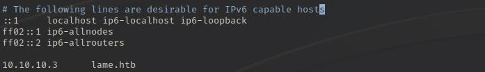
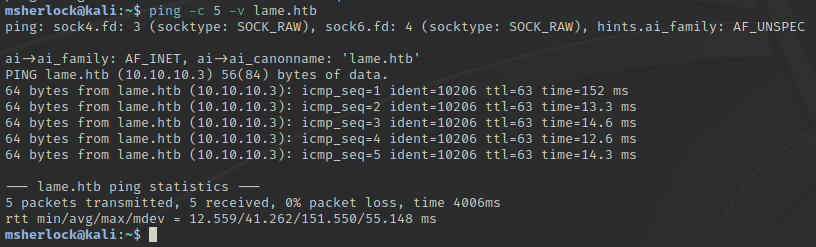
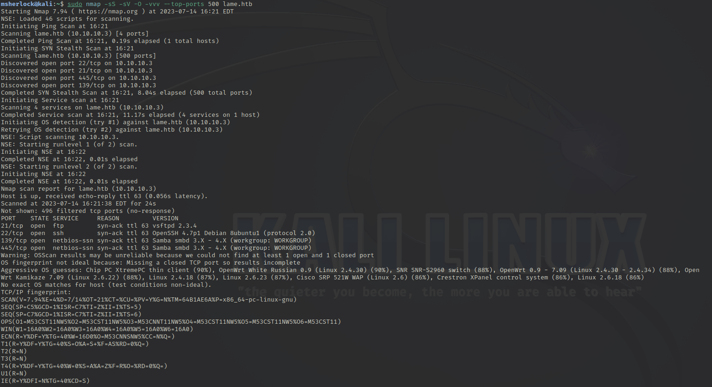
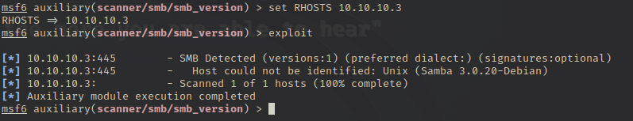

# HackTheBox Machines - Lame
<p align="right"><b>Rating: Easy</b></p>

<p align="center"></p>

### Overview
---
Lame is listed as the first "easy" ranking machine released for HackTheBox, it is incredibly sipmle in terms of the path to gaining a foothold and the foothold also just so happens to be to root privileges on the system.

Because this machine is designed to be extremely basic and for beginners, I will explain the tools used for enumeration and exploitation more in-depth than what would be usual.

### Recon and Enumeration
---

When booting up the machine, users are given the machine's IP Address (10.10.10.3).  For the ease of not needing to remember and type out the address in full, I like to make a practice of adding the address to my /etc/hosts file with vim.

<p align="center"></p>

Upon receiving the target IP Address, a good first step is to ping the target to make sure that before starting any scans, that you can reach the target and that the HackTheBox OpenVPN connection is working.  Some machines will not respond to a ping if a firewall is in use or if ping/ICMP is intentionally disabled on the device but that is also good information to have before beginning scans.

<P align="center"></P>

<b>Explanation of Command:</b>

In the terminal I used the command ```ping -c 5 -v lame.htb```

* `ping` - This is the command itself, which will send an ICMP ECHO_REQUEST to a specified host
* `-c` - This specifies how many ICMP ECHO_REQUESTS should be made, in this case 5 requests
* `-v` - This specifies the output to be more verbose, or detailed
* `lame.htb` - This is the host that the requests will be sent to, a value for the host is a mandatory argument for ping.

We can see that all 5 echo requests received a response so we have confirmation that the machine is up, and that it is responsive.

Next step would be to scan the network for open services are running on the target device.  One of, if not the most popular tools for performing network scans is Nmap.

Nmap can scan large numbers of targets and ports with a variety of scan types and additional options available such as scans for what services are being run on ports, version scans to try and determine the version number of the services being run, what operating system the scanned host is, etc..

<p align="center"></p>

<b>Explanation of Command:</b>

In the terminal I ran the command ```sudo nmap -sS -sV -O -vvv --top-ports 500 lame.htb```

* `nmap` - The command itself to run the Nmap tool
* `-sS` - Tells nmap to perform a SYN scan, to understand the different scan types and their different uses requires an explanation of the TCP three-way handshake.  More information about the TCP three-way handshake can be found here: <br>https://learn.microsoft.com/en-us/troubleshoot/windows-server/networking/three-way-handshake-via-tcpip <br> and more information about the different types of scans that Nmap can perform can be found here: <br>https://nmap.org/book/man-port-scanning-techniques.html <br>
* `-sV` - Scans the ports to determind the services being run on the ports as well as the version information about the services
* `-O` - Scans the host to determine the host's operating system
* `-vvv` - Defines the level of verbosity of the scan's output
* `--top-ports` - This specifies Nmap to scan the number of ports by order of most common port numbers.  In the case of my scan, Nmap will scan the 500 most commonly used ports.
* `lame.htb` - This is the host that is being scanned.

From the scan, we can see that there are several different services being run on the machine.

* <b>Port 21</b>: Port 21 is running the FTP or file transfer protocol service vsftpd version 2.3.4
* <b>Port 22</b>: Port 22 is running the SSH or Secure Shell services OpenSSH version 4.7p1
* <b>Port 139 & 445</b>: These two ports are used to run the SMB package called Samba but the version number cannot quite be determined by the Nmap scan.

Metasploit has a tool that will allow us to determine the exact version number of Samba being run on the machine. ```auxiliary/scanner/smb/smb_version```

<p align="center"></p>

The scan determines that the machine is running Samba version <b>3.0.20</b>.

Finding the version's release date on https://www.samba.org/samba/history/samba-3.0.20.html shows that this version was releasted in 2005, meaning that it is a relatively ANCIENT version of Samba and that there should be a good number of vulnerabilities to choose from.

### Exploitation and Foothold
---

Searching online, I quickly found a vulnerability that was disclosed back in 2007 called CVE-2007-2447 that allows for RCE.

This vulnerability is caused by Samba passing unfiltered user input in MS-RPC calls to /bin/sh when invoking non-default ```"username map script"``` configuration options in ```smb.comf```, so no authentication is needed to exploit the vulnerability.

A more detailed explanation of this exploit can be found on Oussama Amri's security blog: https://amriunix.com/post/cve-2007-2447-samba-usermap-script/

More information about how to exploit the vulnerability can be found at https://0x00sec.org/t/cvexplained-cve-2007-2447/22748

Another simple POC of how to use the exploit using smbclient in the terminal can be found here: https://github.com/b1fair/smb_usermap

